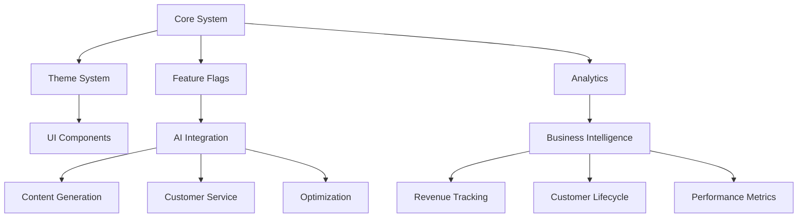

# TASK: O1 PRO - Unify SimplyMaid Core Architecture

## Overview
Unify and optimize the following files into a dual-file architecture:
- Source Files:
  - `apporigin.ts`
  - `appconfig.ts`
  - `fluid-theme.ts`
  - `theme-provider.tsx`
  - `tailwind.config.ts`
  - `components.json`
  - `globals.css`
  - `use-mobile.tsx`
  - `use-toast.tsx`

Target Architecture:
1. `origincore.ts`: Core system and configuration
2. `origintheme.ts`: Unified theme system

## Requirements

### Core Requirements
- **Context-Aware Architecture**
  - Single source of truth with smart navigation
  - Structured for optimal LLM comprehension
  - Comprehensive JSDoc with @cascade directives

- **Developer Experience**
  - Smart code navigation with section markers
  - Integrated LLM helper comments
  - Real-time type validation and hints

- **Documentation Standards**
  - @llm-helpers for common operations
  - @mermaid for visual architecture
  - @description with context boundaries
  - Section-based code organization
  - @version with semantic versioning
  - @changelog tracking major changes
  - @git-context for branch awareness

- **Version Control Integration**
  - Automated version bumping
  - Change tracking with @modified
  - Git commit message templates
  - Branch-aware documentation

- **Technical Foundation**
  - Next.js 15 App Router optimizations
  - Enterprise-grade Zod validation
  - Multi-region deployment (AU/US)
  - Advanced SEO with content clusters

- **Performance & Safety**
  - Smart chunking for large files
  - Safe editing protocols
  - Automated context verification

### Theme Unification
- Simplified color schema using HSL
- Single theme configuration for:
  - Tailwind CSS
  - Shadcn UI
  - Page Builder
  - Dark Mode
- Developer ergonomics:
  - Intuitive color naming
  - Semantic variables
  - Fluid scaling
  - Real-time preview

### Technical Stack
- Next.js 15 (App Router)
- TypeScript 5.x (Strict)
- Tailwind CSS 3.4
- Shadcn UI
- Next-themes 0.4.x
- Zod Validation
- Edge Runtime
- Supabase Stack:
  - Auth & User Management
  - Database & Migrations
  - Edge Functions
  - Real-time Subscriptions
  - Storage

### Supabase Infrastructure
- **Database Schema**
  - User profiles & preferences
  - Service configurations
  - Booking management
  - Content management
  - Analytics storage
  - Feature flags state

- **Migration Strategy**
  - Version-controlled migrations
  - Seed data management
  - Type-safe schema changes
  - Rollback procedures
  - Data validation

- **Edge Functions**
  - Booking processors
  - Notification handlers
  - Content generators
  - Analytics processors
  - Webhook handlers

### Authentication & Authorization
- **Auth Flow**
  - Magic link authentication
  - Social providers (Google)
  - Role-based access control
  - Session management
  - Token refresh strategy

- **Middleware Configuration**
  - Route protection
  - Role verification
  - API authentication
  - Rate limiting
  - CORS policies

- **Security Measures**
  - Row Level Security (RLS)
  - Policy management
  - API key rotation
  - Audit logging
  - Security headers

### Real-time Features
- **Subscriptions**
  - Booking updates
  - Service availability
  - Chat messages
  - Status changes
  - Analytics events

- **Optimistic Updates**
  - UI state management
  - Conflict resolution
  - Offline support
  - Error recovery
  - Cache invalidation

### Database Types
```typescript
// Core Types
interface Profile {
  id: string
  user_id: string
  full_name: string
  avatar_url: string
  preferences: JsonB
  created_at: TimestampTz
}

interface Booking {
  id: string
  user_id: string
  service_id: string
  status: BookingStatus
  schedule: TimestampTz
  details: JsonB
  metadata: JsonB
}

interface Service {
  id: string
  name: string
  description: string
  price_base: number
  availability: JsonB
  regions: string[]
}

interface Content {
  id: string
  slug: string
  type: ContentType
  status: PublishStatus
  data: JsonB
  seo: JsonB
  regions: string[]
}
```

### Business Context
- **Market Position**
  - Leading house cleaning platform in Australia
  - Operating in 7 major cities with suburb coverage
  - Current Revenue: $1.3M (Target: $3M by 2025)
  - Current Traffic: 15-20k monthly (Target: 350k+)

- **Core Business Goals**
  - Revenue Growth Strategy
    - Traffic optimization and scaling
    - LTV/Churn optimization
    - Customer reactivation sequences
    - Automated review management
  - Customer Lifecycle Excellence
    - AI-driven engagement points
    - Automated response system
    - Rating/Review management
    - Churn prediction and prevention
  - Operational Automation
    - LLM-powered customer service
    - Smart scheduling system
    - Dynamic pricing optimization
    - Performance analytics

### Feature Flag System
- **AI-Driven Rollout**
  - Staged deployment strategy
  - A/B testing integration
  - Performance monitoring
  - Automatic rollback capability

- **Feature Categories**
  - Customer Experience
    - Booking flow optimizations
    - Communication preferences
    - Payment methods
    - Service customization
  - Engagement Automation
    - Review solicitation
    - Feedback processing
    - Reactivation triggers
    - Loyalty programs
  - AI Integration
    - Content generation
    - Response automation
    - Pricing optimization
    - Customer segmentation

- **Monitoring & Analytics**
  - Revenue tracking
  - Conversion metrics
  - Customer satisfaction
  - Feature adoption rates
  - Churn indicators
  - LTV optimization

### Customer Lifecycle Architecture
- **Acquisition Phase**
  - Lead capture optimization
  - Multi-channel attribution
  - Conversion tracking
  - Traffic quality scoring

- **Engagement Phase**
  - Service customization
  - Communication preferences
  - Feedback collection
  - Satisfaction monitoring

- **Retention Phase**
  - Churn prediction
  - Reactivation triggers
  - Loyalty programs
  - Service optimization

- **Analytics Integration**
  - Real-time dashboards
  - Predictive modeling
  - Cohort analysis
  - Revenue attribution

### Future-Proofing
- **Anticipated Scale**
  - Multi-region content delivery
  - Dynamic pricing by region
  - Automated content generation pipeline
  - Real-time availability management

- **AI Integration Points**
  - Content generation hooks
  - Personalization engine
  - Customer intent analysis
  - Service matching algorithm

- **Growth Infrastructure**
  - A/B testing framework
  - Hyper-personalization system
  - Push notification architecture
  - Contact list segmentation (350k+)
  - Waterfall data enrichment

- **CMS Evolution**
  - Page model versioning
  - Section model inheritance
  - AI prompt management
  - Content generation workflows
  - Analytics integration

## Project Structure
simplymaid-origin/
├── app/
│   ├── (auth-pages)/        # Auth UI routes
│   ├── protected/           # Protected routes
│   ├── auth/               # Auth API routes
│   ├── actions.ts          # Server actions
│   └── layout.tsx          # Root layout
├── components/
│   ├── ui/                 # Shadcn components
│   ├── auth/               # Auth components
│   └── shared/             # Shared components
├── lib/
│   ├── supabase/          # Supabase clients
│   └── utils/             # Shared utilities
├── middleware.ts           # Auth middleware
└── utils/                 # Helper functions

### Extending Starter
1. **Additional Directories**
   simplymaid-origin/
   ├── core/
   │   ├── origincore.ts     # Core system
   │   └── origintheme.ts    # Theme system
   ├── features/
   │   ├── booking/          # Booking system
   │   ├── content/          # CMS features
   │   └── analytics/        # Analytics
   └── migrations/
       ├── schemas/          # DB schemas
       └── seeds/            # Seed data

2. **Auth Enhancement**
   ```typescript
   // middleware.ts extensions
   export const middleware = new MiddlewareFactory()
     .useAuth()
     .useRoles(['admin', 'customer', 'cleaner'])
     .useRateLimit()
     .useAnalytics()
     .build()
   ```

3. **Database Extensions**
   ```sql
   -- Existing auth schema
   extend schema auth {
     -- Enhanced profiles
     alter table profiles
       add column preferences jsonb,
       add column regions text[];
   }

   -- New schemas
   create schema content;
   create schema bookings;
   create schema analytics;
   ```

### Integration Points
1. **Auth Flow**
   - Using existing auth pages
   - Extending user profiles
   - Adding role management
   - Custom auth hooks

2. **Protected Routes**
   - Role-based access
   - Analytics tracking
   - Error boundaries
   - Loading states

3. **Server Actions**
   - Type-safe mutations
   - Optimistic updates
   - Error handling
   - Rate limiting

4. **Components**
   - Shadcn UI integration
   - Theme system hooks
   - Form validation
   - Error states

### Development Workflow
1. **Local Setup**
   ```bash
   pnpm install
   pnpm supabase start
   pnpm dev
   ```

2. **Database Changes**
   ```bash
   pnpm supabase db diff
   pnpm supabase migration new
   pnpm supabase db reset
   ```

3. **Type Generation**
   ```bash
   pnpm supabase gen types
   pnpm type-check
   ```

## Success Metrics
1. Development:
   - 100% type coverage
   - Zero runtime errors
   - Perfect Lighthouse scores
   - Intuitive theme management

2. Bundle Size:
   - Combined < 80KB gzipped
   - Dynamic imports for large features
   - Optimized asset delivery

3. Performance:
   - FCP < 1.5s
   - TTI < 3.5s
   - CLS < 0.1
   - Mobile-first metrics

4. Business KPIs:
   - Revenue growth tracking
   - Conversion rate by city
   - Customer LTV metrics
   - Churn reduction rate
   - Traffic quality scores

5. AI/LLM Performance:
   - Response accuracy
   - Content generation quality
   - Automation success rate
   - Learning curve metrics

## Implementation Timeline
1. Phase 1: Foundation (Week 1-2)
   - Supabase project setup
   - Authentication implementation
   - Core schema migrations
2. Phase 2: Integration (Week 3-4)
   - AI/LLM integration points
   - Analytics implementation
   - Customer lifecycle hooks

3. Phase 3: Optimization (Week 5-6)
   - Performance tuning
   - A/B testing framework
   - Content generation system

4. Phase 4: Scale (Week 7-8)
   - Multi-region deployment
   - Advanced analytics
   - Full automation suite

## Integration Architecture


## Monitoring & Alerts
1. System Health:
   - API response times
   - Error rates
   - Resource usage
   - Cache hit rates

2. Business Metrics:
   - Revenue by region
   - Conversion rates
   - Customer satisfaction
   - Feature adoption

3. AI/LLM Performance:
   - Generation quality
   - Response accuracy
   - Learning efficiency
   - Automation rates

## Timeline
- Architecture & Implementation: 12h
- Testing & Documentation: 3h
Total: 15h

Ready to proceed with implementation?
